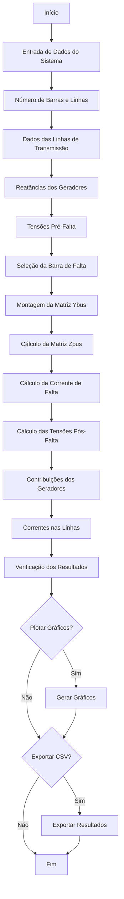

# Análise de Faltas Simétricas - Sistema Elétrico de Potência

## Descrição

Este programa implementa uma análise completa de faltas simétricas em sistemas elétricos de potência, permitindo a entrada flexível de dados para sistemas de qualquer tamanho. O código calcula correntes de falta, tensões pós-falta, e contribuições individuais dos geradores.

## Fluxograma de Operação



## Pré-requisitos

### Bibliotecas Necessárias

```bash
pip install numpy pandas matplotlib
```

### Versões Testadas
- Python 3.7+
- NumPy 1.20+
- Pandas 1.3+
- Matplotlib 3.0+

## Instalação

1. Clone ou baixe o arquivo `fault_analysis.py`
2. Instale as dependências:
   ```bash
   pip install -r requirements.txt
   ```
3. Execute o programa:
   ```bash
   python fault_analysis.py
   ```

## Estrutura do Código

### Funções Principais

#### `get_system_data()`
**Propósito**: Coleta interativa dos dados do sistema elétrico
- Solicita número de barras e linhas
- Coleta dados das linhas de transmissão
- Obtém reatâncias dos geradores
- Define tensões pré-falta

**Validações**:
- Verificação de barras válidas (1 até nb)
- Validação de dados numéricos
- Verificação de reatâncias positivas

#### `analyze_symmetric_fault()`
**Propósito**: Função principal que executa toda a análise de falta
- Monta a matriz Ybus (admitância)
- Calcula a matriz Zbus (impedância)
- Determina corrente de falta
- Calcula tensões pós-falta
- Determina contribuições dos geradores

**Retorna**: Dicionário com todos os resultados calculados

#### `print_complex_matrix()`
**Propósito**: Formatação elegante de matrizes complexas
- Alinhamento automático
- Formatação de números complexos
- Controle de precisão decimal

#### `plot_results()`
**Propósito**: Visualização gráfica dos resultados
- Gráfico de tensões pré/pós-falta
- Gráfico de quedas de tensão
- Gráfico de correntes dos geradores
- Gráfico de correntes nas linhas

#### `export_to_csv()`
**Propósito**: Exportação dos resultados
- Formato CSV para análise posterior
- Dados organizados por tipo (barra, gerador, linha)
- Valores de magnitude e ângulo

## Como Executar

### Execução Básica

```bash
python fault_analysis.py
```

### Fluxo de Entrada de Dados

1. **Número de Barras**
   ```
   Número de barras do sistema: 4
   ```

2. **Número de Linhas**
   ```
   Número de linhas de transmissão: 5
   ```

3. **Dados das Linhas**
   ```
   Linha 1: 1 2 0.50 0.125
   Linha 2: 1 3 0.80 0.25
   Linha 3: 1 4 0.75 0.40
   Linha 4: 2 3 0.80 0.25
   Linha 5: 2 4 0.55 0.20
   ```

4. **Reatâncias dos Geradores**
   ```
   Reatância do gerador na barra 1 (pu): inf
   Reatância do gerador na barra 2 (pu): inf
   Reatância do gerador na barra 3 (pu): 0.30
   Reatância do gerador na barra 4 (pu): 0.30
   ```

5. **Tensões Pré-Falta**
   ```
   Tensões pré-falta separadas por espaço (ou Enter para padrão): [Enter]
   ```

6. **Barra de Falta**
   ```
   Informe a barra em falta (1 a 4): 1
   ```

### Exemplo de Formato de Entrada

```
=== ENTRADA DE DADOS DO SISTEMA ===

Número de barras do sistema: 4
Número de linhas de transmissão: 5

Insira os dados das 5 linhas de transmissão:
Formato: Barra_origem Barra_destino Resistência(pu) Reatância(pu)
Linha 1: 1 2 0.50 0.125
Linha 2: 1 3 0.80 0.25
Linha 3: 1 4 0.75 0.40
Linha 4: 2 3 0.80 0.25
Linha 5: 2 4 0.55 0.20

Insira as reatâncias dos geradores para as 4 barras:
(Digite 'inf' ou um valor muito grande se não houver gerador na barra)
Reatância do gerador na barra 1 (pu): inf
Reatância do gerador na barra 2 (pu): inf
Reatância do gerador na barra 3 (pu): 0.30
Reatância do gerador na barra 4 (pu): 0.30

Insira as tensões pré-falta para as 4 barras:
(Pressione Enter para usar 1.0 pu para todas as barras)
Tensões pré-falta separadas por espaço (ou Enter para padrão): 

=== SELEÇÃO DA BARRA DE FALTA ===
Informe a barra em falta (1 a 4): 1
```

## Resultados Fornecidos

### Saídas no Terminal

1. **Matriz Ybus** (Admitância de Barra)
2. **Matriz Zbus** (Impedância de Barra)
3. **Corrente de Falta** (magnitude e ângulo)
4. **Tensões Pós-Falta** (todas as barras)
5. **Contribuições dos Geradores** (correntes individuais)
6. **Correntes nas Linhas Conectadas à Falta**
7. **Correntes em Todas as Linhas**
8. **Verificação das Contribuições**

### Visualizações Gráficas (Opcional)

- **Gráfico 1**: Tensões pré e pós-falta por barra
- **Gráfico 2**: Quedas de tensão percentuais
- **Gráfico 3**: Correntes dos geradores
- **Gráfico 4**: Correntes nas linhas conectadas à falta

### Exportação CSV (Opcional)

Arquivo CSV com colunas:
- Tipo (Barra, Gerador, Linha_Falta, Linha_Todas)
- Número
- Descrição
- Tensão_Pré_Magnitude/Ângulo
- Tensão_Pós_Magnitude/Ângulo
- Queda_Tensão_Percentual
- Corrente_Magnitude/Ângulo

## Fundamentos Teóricos

### Método de Análise

O programa utiliza o **Método das Impedâncias de Barra (Zbus)** para análise de faltas simétricas:

1. **Matriz Ybus**: Construída a partir das admitâncias das linhas e geradores
2. **Matriz Zbus**: Obtida pela inversão da matriz Ybus
3. **Corrente de Falta**: Calculada usando o equivalente de Thévenin
4. **Tensões Pós-Falta**: Determinadas pelo princípio da superposição

### Fórmulas Utilizadas

- **Corrente de Falta**: `If = V_prefalta / Zbus(i,i)`
- **Tensões Pós-Falta**: `V_pos = V_pre - Zbus(:,i) * If`
- **Correntes dos Geradores**: `Ig = (V_pre - V_pos) / Zg`
- **Correntes nas Linhas**: `Il = (V1 - V2) / Zl`

## Limitações

- **Apenas faltas simétricas** (trifásicas)
- **Sistema balanceado** (sequência positiva)
- **Impedâncias constantes** (não considera saturação)
- **Falta de uma forma imediata de passagem de parâmetros de entrada

## Solução de Problemas

### Erro: "Matriz singular"
- **Causa**: Sistema mal condicionado ou dados incorretos
- **Solução**: Verificar conectividade das barras e valores das impedâncias

### Erro: "Barra inválida"
- **Causa**: Número de barra fora do intervalo válido
- **Solução**: Inserir barras entre 1 e nb

### Erro: "Valores inválidos"
- **Causa**: Entrada de dados não numéricos
- **Solução**: Verificar formato dos dados de entrada

## Exemplo Completo

Para um sistema de 4 barras com 2 geradores nas barras 3 e 4:

```python
# Execução
python fault_analysis.py

# Dados de entrada
Barras: 4
Linhas: 5
Dados das linhas: [1,2,0.5,0.125], [1,3,0.8,0.25], ...
Geradores: Barra 3 (Xg=0.3), Barra 4 (Xg=0.3)
Barra de falta: 1

# Resultados esperados
Corrente de falta: ~2.5 pu
Tensões pós-falta: reduzidas em todas as barras
Contribuições: geradores das barras 3 e 4
```

## Contribuições

Para melhorias ou correções:
1. Faça fork do projeto
2. Crie uma branch para sua feature
3. Commit suas mudanças
4. Push para a branch
5. Abra um Pull Request


## Contato

Para dúvidas ou sugestões, entre em contato através dos issues do GitHub.

---

**Versão**: 2.0  
**Data**: 2025  
**Autor**: Cassio Slika Stella
**Linguagem**: Python 3.7+
